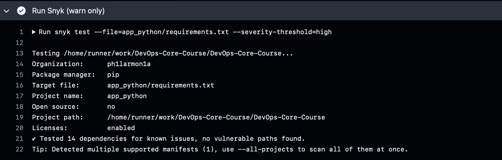

# Lab 03 — Continuous Integration (CI/CD)

## 1. Testing

### Testing framework 

**Choice:** `pytest`

**Why:** I chose `pytest` because it has a clean, readable assertion style, excellent fixture support for setting up a Flask test client, and strong ecosystem plugins like `pytest-cov` for coverage reporting. It also produces clear failure output, which helps debugging.

### Test structure explanation:
Tests are located in `app_python/tests/`:
* `test_app.py` defines reusable fixtures and contains endpoint tests
    * `client` for normal endpoint tests
    * `client_no_propagate` to validate 500 error handler responses as JSON
    * `GET /` validates JSON structure, required fields, types, and headers behavior (e.g., `X-Forwarded-For`)
    * `GET /health` validates the health payload and timestamp format
    * Error cases include `404` for unknown routes and `500` by forcing an internal exception via monkeypatching

### Terminal output showing tests passing:
```bash
$  pytest -v
======================================================================== test session starts =========================================================================
platform darwin -- Python 3.13.3, pytest-9.0.2, pluggy-1.6.0 -- /Users/philarmonia/Documents/current_course/CBS-02/DevOps/DevOps-Core-Course/app_python/venv/bin/python3.13
cachedir: .pytest_cache
rootdir: /Users/philarmonia/Documents/current_course/CBS-02/DevOps/DevOps-Core-Course/app_python
plugins: cov-7.0.0
collected 5 items                                                                                                                                                    

tests/test_app.py::test_get_root_returns_expected_json_structure PASSED                                                                                        [ 20%]
tests/test_app.py::test_root_uses_x_forwarded_for_as_client_ip PASSED                                                                                          [ 40%]
tests/test_app.py::test_get_health_returns_expected_payload PASSED                                                                                             [ 60%]
tests/test_app.py::test_404_returns_json_error_payload PASSED                                                                                                  [ 80%]
tests/test_app.py::test_500_returns_json_error_payload_when_exception_occurs PASSED                                                                            [100%]

========================================================================= 5 passed in 0.12s ==========================================================================
```

## 2. CI Workflow (GitHub Actions)

### Workflow trigger strategy and reasoning:

The workflow runs on:
* `push` to lab03 branch
* `pull_request` to catch issues before merging \
    Path filters are used to avoid unnecessary runs when files outside `app_python/` change.

### Why I chose specific actions from the marketplace:
* `actions/checkout@v4` — standard, reliable way to fetch repo content in CI
* `actions/setup-python@v5` — official Python setup action, supports dependency caching
* `docker/login-action@v3` — secure login to Docker Hub using GitHub Secrets
* `docker/build-push-action@v6` — best-practice build + push with BuildKit

### Docker tagging strategy: (choose what you actually implemented)
I used **CalVer** tags plus `latest`:
* `username/app:YYYY.MM.DD` (example: `2026.02.11`) for traceable builds
* `username/app:latest` for the most recent stable image \
    This provides at least two tags per build: a versioned tag + latest.

### Link to successful workflow run:
* GitHub Actions run: https://github.com/ph1larmon1a/DevOps-Core-Course/actions/runs/21921286148

## 3. CI Best Practices, Security & Performance

### Caching implementation and speed improvement metrics:
Dependency caching is enabled using `actions/setup-python` with pip caching.

I compared workflow runtime before/after caching:
* Before caching: 10s
* After caching: 4s \
    This improvement occurs because pip packages are restored from cache instead of re-downloaded each run.

### CI best practices applied (at least 3) + why they matter:
1. **Path filters** — avoids running Python CI when unrelated files change (faster, cheaper CI)
2. **Concurrency / cancel-in-progress** — prevents wasting CI minutes on outdated commits
3. **Separate concerns** — tests/lint always run, Docker push restricted (optional) to main branch to avoid pushing images for feature branches
4. **Fail-fast** — pipeline stops immediately if lint/tests fail, preventing broken builds and wasted steps

### Snyk integration results and vulnerability handling:
I integrated Snyk scanning to detect dependency vulnerabilities during CI using `SNYK_TOKEN` stored in GitHub Secrets.
* Severity threshold: high (CI fails only for high/critical issues)
* Result: 