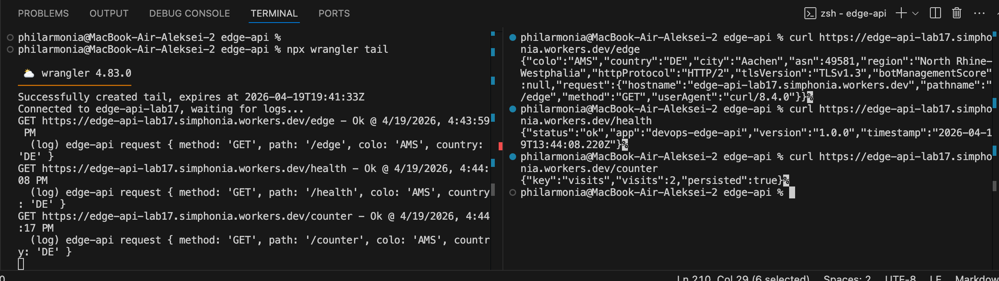
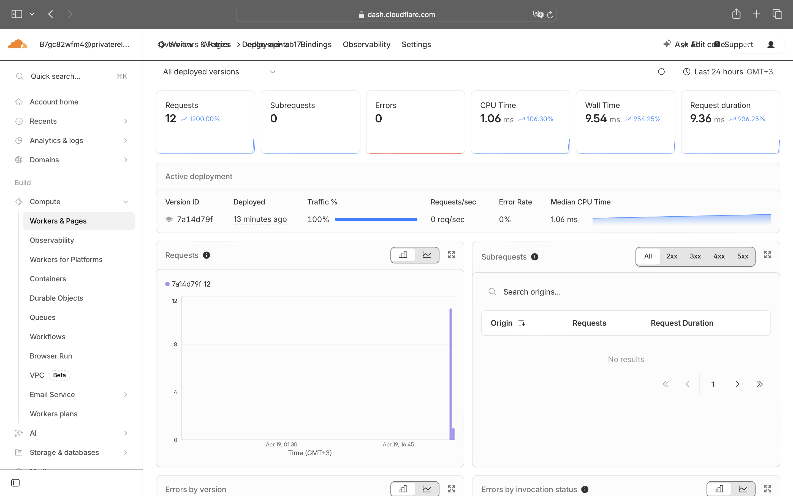
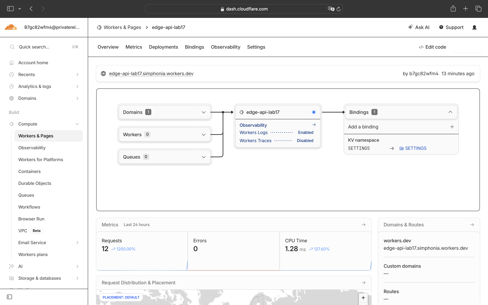

# Cloudflare Workers Lab 17

## Deployment Summary

- Worker project: `edge-api`
- Worker name: `edge-api-lab17`
- Deployed public URL: `https://edge-api-lab17.simphonia.workers.dev`
- Main routes:
  - `GET /` - app and deployment metadata
  - `GET /health` - health check
  - `GET /edge` - Cloudflare edge metadata
  - `GET /config` - vars vs secrets status
  - `GET /counter` - KV-backed persisted visit counter
  - `GET /kv?key=<name>` - read arbitrary KV value
  - `POST /kv` - write arbitrary KV value
- Plaintext vars configured in `wrangler.jsonc`:
  - `APP_NAME`
  - `COURSE_NAME`
  - `APP_VERSION`
  - `DEFAULT_COUNTER_KEY`
- Secrets expected from Wrangler:
  - `API_TOKEN`
  - `ADMIN_EMAIL`
- KV binding:
  - `SETTINGS`

## Required Account-Bound Commands

These steps must be run from your own authenticated Cloudflare account:

```bash
cd edge-api
npm install
npx wrangler login
npx wrangler whoami
npx wrangler secret put API_TOKEN
npx wrangler secret put ADMIN_EMAIL
npx wrangler kv namespace create SETTINGS
npx wrangler kv namespace create SETTINGS --preview
```

After creating KV namespaces, replace the placeholder `id` and `preview_id` values in `wrangler.jsonc`.

## Local Verification

Run locally:

```bash
cd edge-api
cp .dev.vars.example .dev.vars
npx wrangler dev
```

Example checks:

```bash
curl http://127.0.0.1:8787/health
curl http://127.0.0.1:8787/edge
curl -X POST http://127.0.0.1:8787/kv \
  -H "content-type: application/json" \
  -d '{"key":"lab","value":"17"}'
curl http://127.0.0.1:8787/kv?key=lab
curl http://127.0.0.1:8787/counter
```

Expected local `/health` response shape:

```json
{
  "status": "ok",
  "app": "devops-edge-api",
  "version": "1.0.0",
  "timestamp": "2026-04-18T18:00:00.000Z"
}
```

## Public Deployment

Deploy after authentication and KV setup:

```bash
cd edge-api
npx wrangler deploy
```

Verify the public Worker:

```bash
curl https://edge-api-lab17.simphonia.workers.dev/health
curl https://edge-api-lab17.simphonia.workers.dev/edge
curl https://edge-api-lab17.simphonia.workers.dev/config
```

Verified `/health` response on 2026-04-19:

```json
{
  "status": "ok",
  "app": "devops-edge-api",
  "version": "1.0.0",
  "timestamp": "2026-04-19T13:39:30.931Z"
}
```

## Edge Metadata Evidence

Captured `/edge` response from the deployed Worker on 2026-04-19:

```json
{
  "colo": "AMS",
  "country": "DE",
  "city": "Aachen",
  "asn": 49581,
  "region": "North Rhine-Westphalia",
  "httpProtocol": "HTTP/2",
  "tlsVersion": "TLSv1.3",
  "botManagementScore": null,
  "request": {
    "hostname": "edge-api-lab17.simphonia.workers.dev",
    "pathname": "/edge",
    "method": "GET",
    "userAgent": "curl/8.4.0"
  }
}
```

This demonstrates that Cloudflare injects request metadata at the edge. The Worker does not need to choose a deployment region manually. Cloudflare routed this request through the `AMS` colo and reported client geography as Germany (`DE`, Aachen), which shows that metadata is attached during edge execution.

## Routing Concepts

- `workers.dev`: the fastest way to publish a Worker on a public Cloudflare-managed subdomain.
- Routes: attach a Worker to traffic for an existing Cloudflare DNS zone you already manage.
- Custom Domains: make the Worker the origin for a specific domain or subdomain instead of using `workers.dev`.

There is no separate "deploy to three regions" step because Workers is deployed onto Cloudflare’s globally distributed edge platform as one logical service.

## Configuration, Secrets, and Persistence

- Plaintext vars live in `wrangler.jsonc` and are appropriate for non-sensitive values such as app name or course name.
- Secrets are created with `wrangler secret put` and should never be committed to Git.
- `SETTINGS` is a Workers KV namespace used for durable key-value storage.

Verified `/config` response on 2026-04-19:

```json
{
  "app": "devops-edge-api",
  "course": "DevOps Core Course",
  "version": "1.0.0",
  "defaults": {
    "counterKey": "visits"
  },
  "secretsConfigured": {
    "apiToken": true,
    "adminEmail": true
  },
  "explanation": {
    "plaintextVars": "Safe for non-sensitive configuration committed to Git.",
    "secrets": "Sensitive values injected by Wrangler and not committed to the repository."
  }
}
```

Suggested verification flow for persistence:

```bash
curl -X POST https://edge-api-lab17.simphonia.workers.dev/kv \
  -H "content-type: application/json" \
  -d '{"key":"lab-status","value":"completed"}'
curl "https://edge-api-lab17.simphonia.workers.dev/kv?key=lab-status"
npx wrangler deploy
curl "https://edge-api-lab17.simphonia.workers.dev/kv?key=lab-status"
```

Document in your submission that `lab-status=completed` still existed after redeploy.

Verified persisted KV value:

```json
{
  "key": "lab-status",
  "value": "completed",
  "found": true,
  "persisted": true
}
```

The Worker also returned a persisted counter value:

```json
{
  "key": "visits",
  "visits": 1,
  "persisted": true
}
```

## Observability and Operations

Add logs through `console.log()` in `src/index.ts`. This project already logs the request path, colo, and country on every request.

Useful commands:

```bash
npx wrangler tail
npx wrangler deployments list
npx wrangler rollback
```

Observed deployment history on 2026-04-19:

- 2026-04-19T13:31:49.748Z: automatic deployment on upload, version `b340b507-9d60-4e4b-8c7f-b63230add051`
- 2026-04-19T13:31:52.420Z: secret change, version `ba3c1c40-82de-4965-8a3f-9531828e31aa`
- 2026-04-19T13:32:18.361Z: secret change, version `4b25d2da-a500-43b0-94a7-bd8ff033ecc0`
- 2026-04-19T13:35:22.299Z: deployment, version `7a14d79f-85c8-4c0c-b0c2-4a5a647d12fa`

This satisfies the requirement to view deployment history and confirms multiple Worker versions were created. A rollback can be performed with `npx wrangler rollback` if needed.

Evidence screenshots:

- Logs from `wrangler tail`:
  
- Overview and Worker URL:
  
- Metrics page:
  

Example log line description:

- Request path `/edge`
- Edge colo such as `AMS`
- Country such as `DE`

## Kubernetes vs Cloudflare Workers Comparison

| Aspect | Kubernetes | Cloudflare Workers |
|--------|------------|--------------------|
| Setup complexity | High: clusters, manifests, networking, storage, security, rollout strategy | Low: one Worker project and Wrangler config |
| Deployment speed | Usually slower because images must be built, pushed, and rolled out | Very fast because code is uploaded directly to the Workers platform |
| Global distribution | Must be designed with multiple regions, load balancing, and replication | Built in by default through Cloudflare’s edge network |
| Cost for small apps | Higher baseline because clusters or managed control planes cost money | Often cheaper for lightweight APIs with low to moderate traffic |
| State and persistence | Full choice of databases, volumes, operators, and custom runtimes | Externalized state through KV, D1, R2, Durable Objects, etc. |
| Control and flexibility | Maximum control over containers, processes, networking, and runtime | More constrained runtime, but dramatically simpler operational model |
| Best use case | Complex platforms, container workloads, long-running services, custom networking | Edge APIs, request transformation, auth, caching, lightweight backends |

## When to Use Each

### Kubernetes is a better fit when:

- You need long-running containers or background workers
- You need custom OS packages, sidecars, or privileged networking patterns
- You run multi-service platforms with complex stateful workloads

### Cloudflare Workers is a better fit when:

- You need a globally available HTTP API quickly
- You want minimal infrastructure management
- Your app is request-driven and fits the Workers runtime constraints

### Recommendation

For this lab’s API use case, Cloudflare Workers is the better platform because the service is lightweight, HTTP-focused, and benefits from instant global edge distribution. For the earlier course labs involving Docker, Kubernetes remains the better fit because those workloads depend on container control, richer runtime customization, and the broader Kubernetes ecosystem.

## Reflection

- Easier than Kubernetes: deployment setup, public URL exposure, global distribution, and secrets management for a small API.
- More constrained than Kubernetes: no Docker image runtime, no arbitrary background processes, and persistence must use platform services instead of local filesystems.
- What changed because Workers is not a Docker host: the application had to be rewritten as a Workers-native HTTP handler, and file-based visit persistence was replaced with Workers KV.
