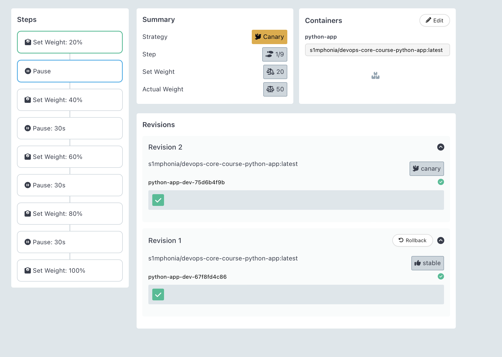
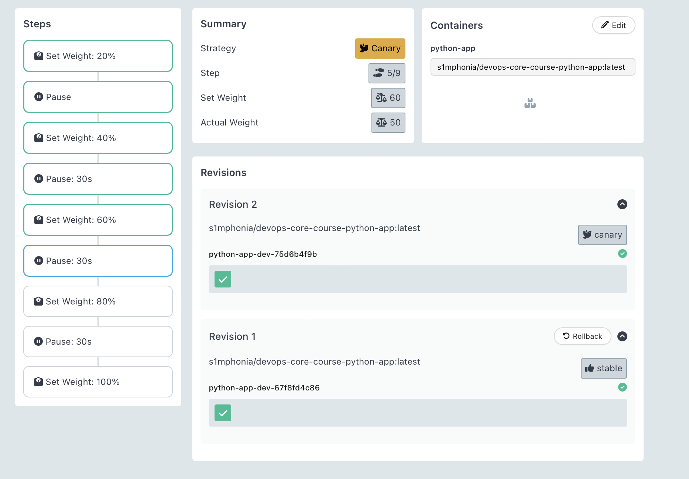
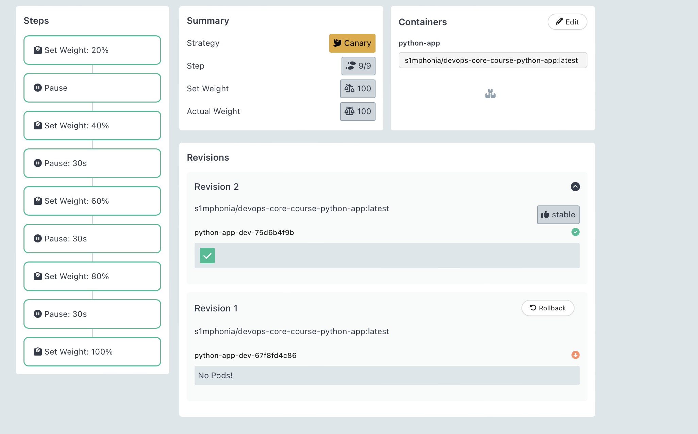
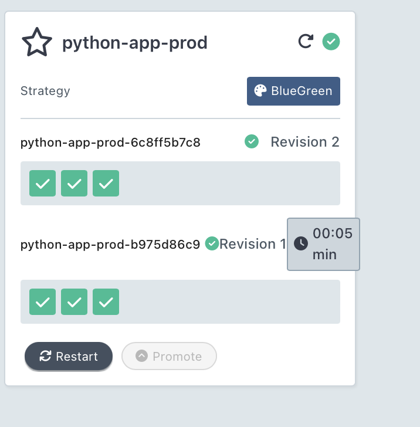
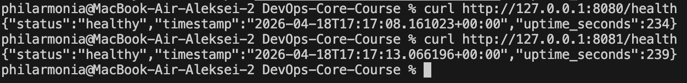
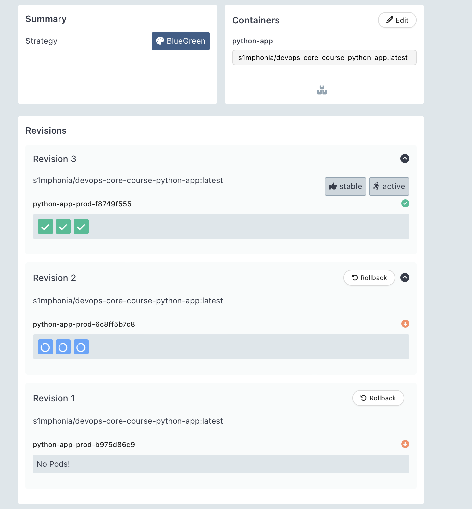

# Lab 14 - Progressive Delivery with Argo Rollouts

This lab extends the Helm chart from Lab 13 by replacing the standard Kubernetes `Deployment` with an Argo Rollouts `Rollout` resource and documenting two progressive-delivery strategies:

- Canary for gradual traffic shifting
- Blue-green for instant promotion and rollback

The chart now uses:

- `values.yaml` / `values-dev.yaml`: canary rollout
- `values-prod.yaml`: blue-green rollout with a preview service

## 1. Argo Rollouts Setup

### Install the controller

```bash
kubectl create namespace argo-rollouts
kubectl apply -n argo-rollouts -f https://github.com/argoproj/argo-rollouts/releases/latest/download/install.yaml
kubectl get pods -n argo-rollouts
```

Expected result:
- `argo-rollouts` controller pod is `Running`

### Install the kubectl plugin

macOS:

```bash
brew install argoproj/tap/kubectl-argo-rollouts
kubectl argo rollouts version
```

Linux:

```bash
curl -LO https://github.com/argoproj/argo-rollouts/releases/latest/download/kubectl-argo-rollouts-linux-amd64
chmod +x kubectl-argo-rollouts-linux-amd64
sudo mv kubectl-argo-rollouts-linux-amd64 /usr/local/bin/kubectl-argo-rollouts
kubectl argo rollouts version
```

### Install the dashboard

```bash
kubectl apply -n argo-rollouts -f https://github.com/argoproj/argo-rollouts/releases/latest/download/dashboard-install.yaml
kubectl port-forward svc/argo-rollouts-dashboard -n argo-rollouts 3100:3100
```

Open http://localhost:3100 and verify that Rollouts appear once the application is deployed.

### Rollout vs Deployment

`Rollout` keeps the same core pod template model as a `Deployment`, but adds progressive-delivery controls:

- `spec.strategy.canary` for staged weight changes and pauses
- `spec.strategy.blueGreen` for active/preview services and controlled promotion
- Promotion, abort, retry, and rollback operations through `kubectl argo rollouts`
- Built-in rollout status visualization in the Argo Rollouts dashboard

## 2. Chart Changes

The Helm chart in `k8s/python-app` now contains:

- `templates/rollout.yaml`: main workload resource
- `templates/service.yaml`: active service
- `templates/preview-service.yaml`: blue-green preview service

Strategy selection is value-driven:

- `rollout.strategy: canary`
- `rollout.strategy: blueGreen`

### Canary configuration

Default canary steps in `values.yaml`:

1. `20%` traffic, then manual pause
2. `40%` traffic, pause `30s`
3. `60%` traffic, pause `30s`
4. `80%` traffic, pause `30s`
5. `100%` traffic

This satisfies the lab requirement for one manual gate followed by automatic progression.

### Blue-green configuration

Production values in `values-prod.yaml` switch to:

- `rollout.strategy: blueGreen`
- active service: the standard release service
- preview service: `<release-name>-preview`
- `autoPromotionEnabled: false` for manual approval

## 3. Canary Deployment Walkthrough

### Deploy canary version

```bash
helm upgrade --install python-app-dev ./k8s/python-app \
  -n dev \
  -f k8s/python-app/values.yaml \
  -f k8s/python-app/values-dev.yaml
```

Or through ArgoCD:

```bash
kubectl apply -f k8s/argocd/application-dev.yaml
argocd app sync python-app-dev
```

### Watch rollout progression

```bash
kubectl argo rollouts get rollout python-app-dev -n dev -w
kubectl argo rollouts dashboard
```

Make a change that triggers a new ReplicaSet, for example:

- update `image.tag`
- add an environment variable
- change ConfigMap-backed configuration

### Promote the manual pause

```bash
kubectl argo rollouts promote python-app-dev -n dev
```

Expected behavior:

- New ReplicaSet receives `20%` traffic first
- Rollout pauses for manual review
- After promotion, rollout progresses automatically through `40%`, `60%`, `80%`, and `100%`

### Abort and roll back

```bash
kubectl argo rollouts abort python-app-dev -n dev
kubectl argo rollouts get rollout python-app-dev -n dev
kubectl argo rollouts retry rollout python-app-dev -n dev
```

When aborted during canary, traffic returns to the stable ReplicaSet instead of finishing promotion.

### Suggested dashboard screenshots





## 4. Blue-Green Deployment Walkthrough

### Deploy blue-green version

```bash
helm upgrade --install python-app-prod ./k8s/python-app \
  -n prod \
  -f k8s/python-app/values.yaml \
  -f k8s/python-app/values-prod.yaml
```

Or through ArgoCD:

```bash
kubectl apply -f k8s/argocd/application-prod.yaml
argocd app sync python-app-prod
```

### Verify active and preview services

```bash
kubectl get svc -n prod
kubectl port-forward svc/python-app-prod -n prod 8080:80
kubectl port-forward svc/python-app-prod-preview -n prod 8081:80
```

Expected behavior:

- Port `8080` reaches the active production version
- Port `8081` reaches the preview version created by the new ReplicaSet

### Promote the preview version

```bash
kubectl argo rollouts promote python-app-prod -n prod
kubectl argo rollouts get rollout python-app-prod -n prod
```

Expected behavior:

- Preview environment is tested before promotion
- Promotion switches the active service selector to the new ReplicaSet almost instantly

### Roll back after promotion

```bash
kubectl argo rollouts undo python-app-prod -n prod
kubectl argo rollouts get rollout python-app-prod -n prod
```

Blue-green rollback is effectively an instant service switch, which is noticeably faster than reversing a partially progressed canary rollout.

### Suggested dashboard screenshots



## 5. Strategy Comparison

| Topic | Canary | Blue-Green |
| --- | --- | --- |
| Traffic shift | Gradual, percentage-based | Instant, all-at-once |
| Validation style | Observe live traffic behavior over time | Test preview environment before cutover |
| Resource usage | Lower | Higher, because two full versions may run together |
| Rollback speed | Fast, but may involve reversing intermediate steps | Fastest, usually a service switch |
| Best fit | Low-risk continuous releases, incremental exposure | High-confidence cutovers, strong preview/testing needs |

Recommendation:

- Use canary in `dev` or lower-risk environments where gradual exposure is useful
- Use blue-green in `prod` when preview validation and instant rollback are more valuable than temporary extra resource usage

## 6. CLI Reference

Useful commands for this lab:

```bash
kubectl argo rollouts list rollouts -A
kubectl argo rollouts get rollout <name> -n <namespace> -w
kubectl argo rollouts promote <name> -n <namespace>
kubectl argo rollouts abort <name> -n <namespace>
kubectl argo rollouts retry rollout <name> -n <namespace>
kubectl argo rollouts undo <name> -n <namespace>
kubectl argo rollouts dashboard
kubectl describe rollout <name> -n <namespace>
kubectl get rs,pods,svc -n <namespace>
```

## 7. ArgoCD Integration

The ArgoCD application manifests in `k8s/argocd` were updated to target the `lab14` branch so ArgoCD can deploy the rollout-enabled Helm chart.

- `application.yaml`
- `application-dev.yaml`
- `application-prod.yaml`

Dev keeps automatic sync, while prod stays manual as a safer promotion workflow.
