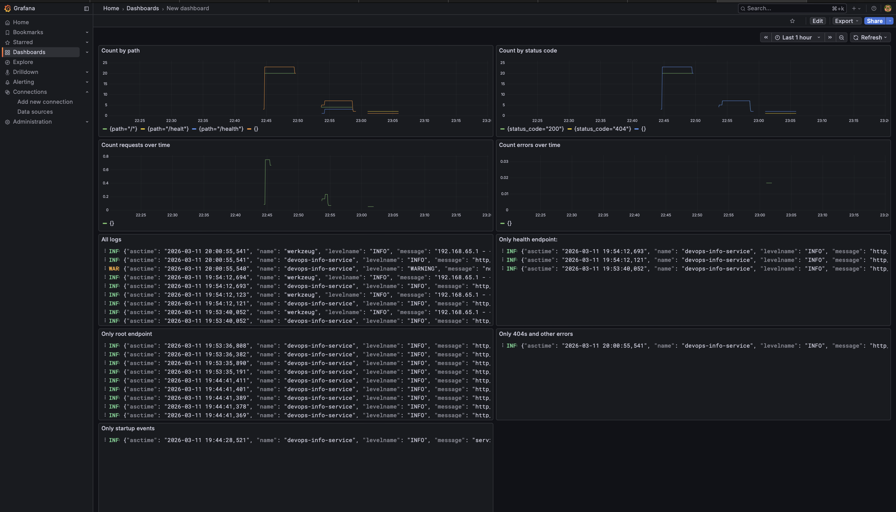

# LAB07 – Centralized Logging with Loki Stack

## 1. Overview

This lab implements a centralized logging system using the **Loki Stack** consisting of:

* **Python Flask application** generating structured logs
* **Promtail** collecting container logs
* **Loki** storing logs
* **Grafana** querying and visualizing logs

Log pipeline:

Python App → Promtail → Loki → Grafana

The stack is deployed using **Docker Compose** and allows real-time log collection and analysis.

---

# 2. Architecture

Components used in the system:

| Component        | Role                                 |
| ---------------- | ------------------------------------ |
| Python Flask App | Generates application logs           |
| Promtail         | Collects logs from Docker containers |
| Loki             | Stores and indexes logs              |
| Grafana          | Visualizes logs and metrics          |

Log flow:

1. The Python application outputs **structured JSON logs** to stdout.
2. Docker stores logs in container log files.
3. Promtail discovers containers and collects logs.
4. Logs are pushed to Loki.
5. Grafana queries Loki using **LogQL** and displays dashboards.

---

# 3. Deployment

The stack is deployed using Docker Compose.

Start the services:

```bash
docker compose up -d
```

Verify running containers:

```bash
docker compose ps
```

Output:

```
8611438c035a   grafana/promtail:3.0.0                           "/usr/bin/promtail -…"   47 minutes ago   Up 47 minutes             0.0.0.0:9080->9080/tcp   monitoring-promtail-1
fee51ecebed1   grafana/grafana:12.3.1                           "/run.sh"                47 minutes ago   Up 47 minutes (healthy)   0.0.0.0:3000->3000/tcp   monitoring-grafana-1
1992ca082be7   s1mphonia/devops-core-course-python-app:latest   "python app.py"          47 minutes ago   Up 47 minutes             0.0.0.0:8000->8000/tcp   monitoring-app-python-1
79f225e41a7c   grafana/loki:3.0.0                               "/usr/bin/loki -conf…"   47 minutes ago   Up 47 minutes (healthy)   0.0.0.0:3100->3100/tcp   monitoring-loki-1
```

---

# 4. Service Endpoints

| Service    | URL                   |
| ---------- | --------------------- |
| Python App | http://localhost:8000 |
| Loki       | http://localhost:3100 |
| Grafana    | http://localhost:3000 |
| Promtail   | http://localhost:9080 |

Grafana login credentials:

```
username: admin
password: admin123
```

---

# 5. Structured Logging

The Python Flask application was modified to produce **structured JSON logs** using `python-json-logger`.

Each request log contains metadata such as:

* event
* service
* method
* path
* status_code
* client_ip
* duration_ms

Example log entry:

```json
{
  "asctime": "2026-03-11 19:54:12,693",
  "name": "devops-info-service",
  "levelname": "INFO",
  "message": "http_request",
  "event": "http_request",
  "service": "devops-info-service",
  "method": "GET",
  "path": "/health",
  "status_code": 200,
  "client_ip": "192.168.65.1",
  "user_agent": "curl/8.4.0",
  "duration_ms": 0.15
}
```

These structured logs allow Loki to parse fields and enable powerful queries.

---

# 6. Log Generation

Logs were generated using HTTP requests:

```bash
curl http://localhost:8000/
curl http://localhost:8000/health
curl http://localhost:8000/not-found
```

Bulk requests:

```bash
for i in {1..20}; do curl -s http://localhost:8000/health; done
```

```
{"endpoints":[{"description":"Service information","method":"GET","path":"/"},{"description":"Health check","method":"GET","path":"/health"}],"request":{"client_ip":"192.168.65.1","method":"GET","path":"/","user_agent":"curl/8.4.0"},"runtime":{"current_time":"2026-03-11T20:34:13.548061+00:00","timezone":"UTC","uptime_human":"49 minutes","uptime_seconds":2985},"service":{"description":"DevOps course info service","framework":"Flask","name":"devops-info-service","version":"1.0.0"},"system":{"architecture":"aarch64","cpu_count":8,"hostname":"1992ca082be7","platform":"Linux","platform_version":"#1 SMP Mon Feb 24 16:35:16 UTC 2025","python_version":"3.13.12"}}
{"endpoints":[{"description":"Service information","method":"GET","path":"/"},{"description":"Health check","method":"GET","path":"/health"}],"request":{"client_ip":"192.168.65.1","method":"GET","path":"/","user_agent":"curl/8.4.0"},"runtime":{"current_time":"2026-03-11T20:34:13.570785+00:00","timezone":"UTC","uptime_human":"49 minutes","uptime_seconds":2985},"service":{"description":"DevOps course info service","framework":"Flask","name":"devops-info-service","version":"1.0.0"},"system":{"architecture":"aarch64","cpu_count":8,"hostname":"1992ca082be7","platform":"Linux","platform_version":"#1 SMP Mon Feb 24 16:35:16 UTC 2025","python_version":"3.13.12"}}
{"endpoints":[{"description":"Service information","method":"GET","path":"/"},{"description":"Health check","method":"GET","path":"/health"}],"request":{"client_ip":"192.168.65.1","method":"GET","path":"/","user_agent":"curl/8.4.0"},"runtime":{"current_time":"2026-03-11T20:34:13.589053+00:00","timezone":"UTC","uptime_human":"49 minutes","uptime_seconds":2985},"service":{"description":"DevOps course info service","framework":"Flask","name":"devops-info-service","version":"1.0.0"},"system":{"architecture":"aarch64","cpu_count":8,"hostname":"1992ca082be7","platform":"Linux","platform_version":"#1 SMP Mon Feb 24 16:35:16 UTC 2025","python_version":"3.13.12"}}
{"endpoints":[{"description":"Service information","method":"GET","path":"/"},{"description":"Health check","method":"GET","path":"/health"}],"request":{"client_ip":"192.168.65.1","method":"GET","path":"/","user_agent":"curl/8.4.0"},"runtime":{"current_time":"2026-03-11T20:34:13.603101+00:00","timezone":"UTC","uptime_human":"49 minutes","uptime_seconds":2985},"service":{"description":"DevOps course info service","framework":"Flask","name":"devops-info-service","version":"1.0.0"},"system":{"architecture":"aarch64","cpu_count":8,"hostname":"1992ca082be7","platform":"Linux","platform_version":"#1 SMP Mon Feb 24 16:35:16 UTC 2025","python_version":"3.13.12"}}
{"endpoints":[{"description":"Service information","method":"GET","path":"/"},{"description":"Health check","method":"GET","path":"/health"}],"request":{"client_ip":"192.168.65.1","method":"GET","path":"/","user_agent":"curl/8.4.0"},"runtime":{"current_time":"2026-03-11T20:34:13.616465+00:00","timezone":"UTC","uptime_human":"49 minutes","uptime_seconds":2985},"service":{"description":"DevOps course info service","framework":"Flask","name":"devops-info-service","version":"1.0.0"},"system":{"architecture":"aarch64","cpu_count":8,"hostname":"1992ca082be7","platform":"Linux","platform_version":"#1 SMP Mon Feb 24 16:35:16 UTC 2025","python_version":"3.13.12"}}
{"endpoints":[{"description":"Service information","method":"GET","path":"/"},{"description":"Health check","method":"GET","path":"/health"}],"request":{"client_ip":"192.168.65.1","method":"GET","path":"/","user_agent":"curl/8.4.0"},"runtime":{"current_time":"2026-03-11T20:34:13.634901+00:00","timezone":"UTC","uptime_human":"49 minutes","uptime_seconds":2985},"service":{"description":"DevOps course info service","framework":"Flask","name":"devops-info-service","version":"1.0.0"},"system":{"architecture":"aarch64","cpu_count":8,"hostname":"1992ca082be7","platform":"Linux","platform_version":"#1 SMP Mon Feb 24 16:35:16 UTC 2025","python_version":"3.13.12"}}
{"endpoints":[{"description":"Service information","method":"GET","path":"/"},{"description":"Health check","method":"GET","path":"/health"}],"request":{"client_ip":"192.168.65.1","method":"GET","path":"/","user_agent":"curl/8.4.0"},"runtime":{"current_time":"2026-03-11T20:34:13.647048+00:00","timezone":"UTC","uptime_human":"49 minutes","uptime_seconds":2985},"service":{"description":"DevOps course info service","framework":"Flask","name":"devops-info-service","version":"1.0.0"},"system":{"architecture":"aarch64","cpu_count":8,"hostname":"1992ca082be7","platform":"Linux","platform_version":"#1 SMP Mon Feb 24 16:35:16 UTC 2025","python_version":"3.13.12"}}
{"endpoints":[{"description":"Service information","method":"GET","path":"/"},{"description":"Health check","method":"GET","path":"/health"}],"request":{"client_ip":"192.168.65.1","method":"GET","path":"/","user_agent":"curl/8.4.0"},"runtime":{"current_time":"2026-03-11T20:34:13.656848+00:00","timezone":"UTC","uptime_human":"49 minutes","uptime_seconds":2985},"service":{"description":"DevOps course info service","framework":"Flask","name":"devops-info-service","version":"1.0.0"},"system":{"architecture":"aarch64","cpu_count":8,"hostname":"1992ca082be7","platform":"Linux","platform_version":"#1 SMP Mon Feb 24 16:35:16 UTC 2025","python_version":"3.13.12"}}
{"endpoints":[{"description":"Service information","method":"GET","path":"/"},{"description":"Health check","method":"GET","path":"/health"}],"request":{"client_ip":"192.168.65.1","method":"GET","path":"/","user_agent":"curl/8.4.0"},"runtime":{"current_time":"2026-03-11T20:34:13.667628+00:00","timezone":"UTC","uptime_human":"49 minutes","uptime_seconds":2985},"service":{"description":"DevOps course info service","framework":"Flask","name":"devops-info-service","version":"1.0.0"},"system":{"architecture":"aarch64","cpu_count":8,"hostname":"1992ca082be7","platform":"Linux","platform_version":"#1 SMP Mon Feb 24 16:35:16 UTC 2025","python_version":"3.13.12"}}
{"endpoints":[{"description":"Service information","method":"GET","path":"/"},{"description":"Health check","method":"GET","path":"/health"}],"request":{"client_ip":"192.168.65.1","method":"GET","path":"/","user_agent":"curl/8.4.0"},"runtime":{"current_time":"2026-03-11T20:34:13.679795+00:00","timezone":"UTC","uptime_human":"49 minutes","uptime_seconds":2985},"service":{"description":"DevOps course info service","framework":"Flask","name":"devops-info-service","version":"1.0.0"},"system":{"architecture":"aarch64","cpu_count":8,"hostname":"1992ca082be7","platform":"Linux","platform_version":"#1 SMP Mon Feb 24 16:35:16 UTC 2025","python_version":"3.13.12"}}
{"endpoints":[{"description":"Service information","method":"GET","path":"/"},{"description":"Health check","method":"GET","path":"/health"}],"request":{"client_ip":"192.168.65.1","method":"GET","path":"/","user_agent":"curl/8.4.0"},"runtime":{"current_time":"2026-03-11T20:34:13.692569+00:00","timezone":"UTC","uptime_human":"49 minutes","uptime_seconds":2985},"service":{"description":"DevOps course info service","framework":"Flask","name":"devops-info-service","version":"1.0.0"},"system":{"architecture":"aarch64","cpu_count":8,"hostname":"1992ca082be7","platform":"Linux","platform_version":"#1 SMP Mon Feb 24 16:35:16 UTC 2025","python_version":"3.13.12"}}
{"endpoints":[{"description":"Service information","method":"GET","path":"/"},{"description":"Health check","method":"GET","path":"/health"}],"request":{"client_ip":"192.168.65.1","method":"GET","path":"/","user_agent":"curl/8.4.0"},"runtime":{"current_time":"2026-03-11T20:34:13.704377+00:00","timezone":"UTC","uptime_human":"49 minutes","uptime_seconds":2985},"service":{"description":"DevOps course info service","framework":"Flask","name":"devops-info-service","version":"1.0.0"},"system":{"architecture":"aarch64","cpu_count":8,"hostname":"1992ca082be7","platform":"Linux","platform_version":"#1 SMP Mon Feb 24 16:35:16 UTC 2025","python_version":"3.13.12"}}
{"endpoints":[{"description":"Service information","method":"GET","path":"/"},{"description":"Health check","method":"GET","path":"/health"}],"request":{"client_ip":"192.168.65.1","method":"GET","path":"/","user_agent":"curl/8.4.0"},"runtime":{"current_time":"2026-03-11T20:34:13.714262+00:00","timezone":"UTC","uptime_human":"49 minutes","uptime_seconds":2985},"service":{"description":"DevOps course info service","framework":"Flask","name":"devops-info-service","version":"1.0.0"},"system":{"architecture":"aarch64","cpu_count":8,"hostname":"1992ca082be7","platform":"Linux","platform_version":"#1 SMP Mon Feb 24 16:35:16 UTC 2025","python_version":"3.13.12"}}
{"endpoints":[{"description":"Service information","method":"GET","path":"/"},{"description":"Health check","method":"GET","path":"/health"}],"request":{"client_ip":"192.168.65.1","method":"GET","path":"/","user_agent":"curl/8.4.0"},"runtime":{"current_time":"2026-03-11T20:34:13.724354+00:00","timezone":"UTC","uptime_human":"49 minutes","uptime_seconds":2985},"service":{"description":"DevOps course info service","framework":"Flask","name":"devops-info-service","version":"1.0.0"},"system":{"architecture":"aarch64","cpu_count":8,"hostname":"1992ca082be7","platform":"Linux","platform_version":"#1 SMP Mon Feb 24 16:35:16 UTC 2025","python_version":"3.13.12"}}
{"endpoints":[{"description":"Service information","method":"GET","path":"/"},{"description":"Health check","method":"GET","path":"/health"}],"request":{"client_ip":"192.168.65.1","method":"GET","path":"/","user_agent":"curl/8.4.0"},"runtime":{"current_time":"2026-03-11T20:34:13.734059+00:00","timezone":"UTC","uptime_human":"49 minutes","uptime_seconds":2985},"service":{"description":"DevOps course info service","framework":"Flask","name":"devops-info-service","version":"1.0.0"},"system":{"architecture":"aarch64","cpu_count":8,"hostname":"1992ca082be7","platform":"Linux","platform_version":"#1 SMP Mon Feb 24 16:35:16 UTC 2025","python_version":"3.13.12"}}
{"endpoints":[{"description":"Service information","method":"GET","path":"/"},{"description":"Health check","method":"GET","path":"/health"}],"request":{"client_ip":"192.168.65.1","method":"GET","path":"/","user_agent":"curl/8.4.0"},"runtime":{"current_time":"2026-03-11T20:34:13.744615+00:00","timezone":"UTC","uptime_human":"49 minutes","uptime_seconds":2985},"service":{"description":"DevOps course info service","framework":"Flask","name":"devops-info-service","version":"1.0.0"},"system":{"architecture":"aarch64","cpu_count":8,"hostname":"1992ca082be7","platform":"Linux","platform_version":"#1 SMP Mon Feb 24 16:35:16 UTC 2025","python_version":"3.13.12"}}
{"endpoints":[{"description":"Service information","method":"GET","path":"/"},{"description":"Health check","method":"GET","path":"/health"}],"request":{"client_ip":"192.168.65.1","method":"GET","path":"/","user_agent":"curl/8.4.0"},"runtime":{"current_time":"2026-03-11T20:34:13.755045+00:00","timezone":"UTC","uptime_human":"49 minutes","uptime_seconds":2985},"service":{"description":"DevOps course info service","framework":"Flask","name":"devops-info-service","version":"1.0.0"},"system":{"architecture":"aarch64","cpu_count":8,"hostname":"1992ca082be7","platform":"Linux","platform_version":"#1 SMP Mon Feb 24 16:35:16 UTC 2025","python_version":"3.13.12"}}
{"endpoints":[{"description":"Service information","method":"GET","path":"/"},{"description":"Health check","method":"GET","path":"/health"}],"request":{"client_ip":"192.168.65.1","method":"GET","path":"/","user_agent":"curl/8.4.0"},"runtime":{"current_time":"2026-03-11T20:34:13.766614+00:00","timezone":"UTC","uptime_human":"49 minutes","uptime_seconds":2985},"service":{"description":"DevOps course info service","framework":"Flask","name":"devops-info-service","version":"1.0.0"},"system":{"architecture":"aarch64","cpu_count":8,"hostname":"1992ca082be7","platform":"Linux","platform_version":"#1 SMP Mon Feb 24 16:35:16 UTC 2025","python_version":"3.13.12"}}
{"endpoints":[{"description":"Service information","method":"GET","path":"/"},{"description":"Health check","method":"GET","path":"/health"}],"request":{"client_ip":"192.168.65.1","method":"GET","path":"/","user_agent":"curl/8.4.0"},"runtime":{"current_time":"2026-03-11T20:34:13.778115+00:00","timezone":"UTC","uptime_human":"49 minutes","uptime_seconds":2985},"service":{"description":"DevOps course info service","framework":"Flask","name":"devops-info-service","version":"1.0.0"},"system":{"architecture":"aarch64","cpu_count":8,"hostname":"1992ca082be7","platform":"Linux","platform_version":"#1 SMP Mon Feb 24 16:35:16 UTC 2025","python_version":"3.13.12"}}
{"endpoints":[{"description":"Service information","method":"GET","path":"/"},{"description":"Health check","method":"GET","path":"/health"}],"request":{"client_ip":"192.168.65.1","method":"GET","path":"/","user_agent":"curl/8.4.0"},"runtime":{"current_time":"2026-03-11T20:34:13.791435+00:00","timezone":"UTC","uptime_human":"49 minutes","uptime_seconds":2985},"service":{"description":"DevOps course info service","framework":"Flask","name":"devops-info-service","version":"1.0.0"},"system":{"architecture":"aarch64","cpu_count":8,"hostname":"1992ca082be7","platform":"Linux","platform_version":"#1 SMP Mon Feb 24 16:35:16 UTC 2025","python_version":"3.13.12"}}
```
These requests generate logs for:

* root endpoint `/`
* health endpoint `/health`
* error endpoint `/not-found`

---

# 7. LogQL Queries

Logs are queried in Grafana using **LogQL**.

## All parsed logs

```logql
{container="monitoring-app-python-1"} | json 
```

---

## Only `/health` endpoint

```logql
{container="monitoring-app-python-1"} | json | path="/health"
```

---

## Only `/` endpoint

```logql
{container="monitoring-app-python-1"} | json | path="/"
```

---

## Error logs (404 and others)

```logql
{container="monitoring-app-python-1"} | json | status_code >= 400
```

---

## Count requests by path

```logql
sum by (path) (
 count_over_time(
   {container="monitoring-app-python-1"} | json | __error__="" [5m]
 )
)
```

---

## Count requests by status code

```logql
sum by (status_code) (
 count_over_time(
   {container="monitoring-app-python-1"} | json | __error__="" [5m]
 )
)
```

---

## Request rate

```logql
sum(
 rate(
   {container="monitoring-app-python-1"} | json | __error__="" [1m]
 )
)
```

---

## Error rate

```logql
sum(
 rate(
   {container=~"monitoring-app-python-1"} | json | __error__="" | status_code >= 400 [1m]
 )
)
```

---

# 8. Grafana Dashboard

A Grafana dashboard was created with the following panels:

### Metrics Panels

1. **Count by path**

   * Shows number of requests per endpoint.

2. **Count by status code**

   * Shows distribution of HTTP responses.

3. **Count requests over time**

   * Displays requests per second.

4. **Count errors over time**

   * Displays frequency of HTTP errors.

### Log Panels

5. **All logs**
6. **Only health endpoint**
7. **Only root endpoint**
8. **Only 404 and other errors**
9. **Only startup events**

These panels provide both **metric visualization and raw log inspection**.



---

# 9. Production Readiness Improvements

To make the stack closer to production environments, several improvements were implemented.

### Health Checks

Health checks were configured for all services.

Examples:

Python app:

```
/health
```

Loki:

```
/ready
```

Grafana:

```
/api/health
```

---

### Restart Policies

Containers restart automatically:

```
restart: unless-stopped
```

This ensures service recovery after failures or host reboots.

---

### Resource Limits

CPU and memory limits were defined in Docker Compose to prevent excessive resource consumption.

Example:

```
cpus: 1
memory: 1G
```

---

### Security Configuration

Basic security measures were implemented:

* Grafana anonymous access disabled
* Admin password configured
* Only necessary ports exposed

---

# 10. Issues Encountered

### Loki Startup Failure

Initially Loki failed to start due to an attempt to use **Consul on port 8500**.

Error:

```
unable to initialise ring state
dial tcp localhost:8500
```

Solution:

The ring configuration was changed to use an **in-memory KV store**.

```
ring:
  kvstore:
    store: inmemory
```

---

### JSON Parsing Errors

Some container logs were not valid JSON (e.g., Werkzeug logs).

This caused `JSONParserErr` errors in LogQL.

Solution:

Queries were updated with:

```
| __error__=""
```

This filters only valid JSON logs.

---

# 11. Verification

Service health was verified with:

```bash
curl http://localhost:8000/health
curl http://localhost:3100/ready
curl http://localhost:3000/api/health
```

All services returned healthy responses.

```text

{"status":"healthy","timestamp":"2026-03-11T20:39:23.289953+00:00","uptime_seconds":3294}

ready

{
  "database": "ok",
  "version": "12.3.1",
  "commit": "3a1c80ca7ce612f309fdc99338dd3c5e486339be"
}
```

---

# 12. Conclusion

The Loki logging stack was successfully deployed using Docker Compose.
The Python application produced structured JSON logs which were collected by Promtail, stored in Loki, and visualized in Grafana dashboards.

The system enables real-time log analysis, endpoint monitoring, and error tracking through LogQL queries and dashboards.

This implementation demonstrates how centralized logging can be integrated into containerized applications for monitoring and observability.
