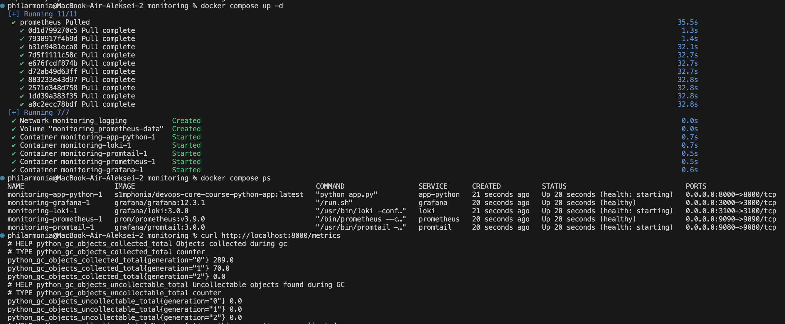
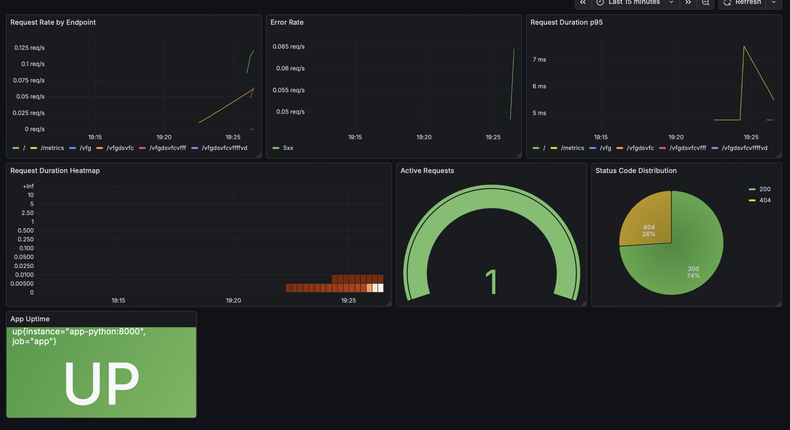

# Lab 8 - Metrics & Monitoring with Prometheus

## Architecture

```text
Browser / curl
    |
    v
Flask app (/ , /health, /metrics)
    |                \
    | metrics         \ logs
    v                  v
Prometheus <--------- Promtail ---------> Loki
    |
    v
Grafana
```

The Python service exposes application and runtime metrics on `/metrics`. Prometheus scrapes the app, Loki, Grafana, and itself every 15 seconds. Grafana reads Prometheus for metrics dashboards and Loki for logs.

## Application Instrumentation

### Metrics added

| Metric | Type | Labels | Why it exists |
|---|---|---|---|
| `http_requests_total` | Counter | `method`, `endpoint`, `status_code` | Measures request rate and error counts |
| `http_request_duration_seconds` | Histogram | `method`, `endpoint` | Measures latency distribution and supports p95 queries |
| `http_requests_in_progress` | Gauge | none | Shows concurrent requests |
| `devops_info_endpoint_calls_total` | Counter | `endpoint` | Tracks feature usage for business-level visibility |
| `devops_info_system_collection_seconds` | Histogram | none | Measures system metadata collection cost |
| `devops_info_app_info` | Gauge | `name`, `version`, `framework` | Publishes static application metadata |

### Implementation notes

- `before_request` stores a high-resolution start time and increments the in-progress gauge.
- `after_request` normalizes the endpoint, records the histogram sample, increments the request counter, and logs request metadata.
- `/metrics` returns the Prometheus text exposition format using `generate_latest()`.
- Endpoint labels are normalized so cardinality stays low.

## Prometheus Configuration

File: `monitoring/prometheus/prometheus.yml`

### Scrape settings

- Scrape interval: `15s`
- Evaluation interval: `15s`
- Targets:
  - `prometheus` -> `localhost:9090`
  - `app` -> `app-python:8000/metrics`
  - `loki` -> `loki:3100/metrics`
  - `grafana` -> `grafana:3000/metrics`

### Retention

Prometheus retention is configured in Docker Compose:

- Time retention: `15d`
- Size retention: `10GB`
- TSDB path: `/prometheus`

This keeps the setup aligned with the lab requirement and avoids uncontrolled disk growth.

## Dashboard Walkthrough

The dashboard is provisioned from `monitoring/grafana/dashboards/lab08-app-dashboard.json` and contains 7 panels:

1. **Request Rate by Endpoint**  
   Query: `sum by (endpoint) (rate(http_requests_total[5m]))`
2. **Error Rate**  
   Query: `sum(rate(http_requests_total{status_code=~"5.."}[5m]))`
3. **Request Duration p95**  
   Query: `histogram_quantile(0.95, sum by (le, endpoint) (rate(http_request_duration_seconds_bucket[5m])))`
4. **Request Duration Heatmap**  
   Query: `sum by (le) (rate(http_request_duration_seconds_bucket[5m]))`
5. **Active Requests**  
   Query: `http_requests_in_progress`
6. **Status Code Distribution**  
   Query: `sum by (status_code) (rate(http_requests_total[5m]))`
7. **App Uptime**  
   Query: `up{job="app"}`

## PromQL Examples

1. Total request rate by endpoint  
   `sum by (endpoint) (rate(http_requests_total[5m]))`
2. 5xx error rate  
   `sum(rate(http_requests_total{status_code=~"5.."}[5m]))`
3. 4xx rate by endpoint  
   `sum by (endpoint) (rate(http_requests_total{status_code=~"4.."}[5m]))`
4. p95 latency by endpoint  
   `histogram_quantile(0.95, sum by (le, endpoint) (rate(http_request_duration_seconds_bucket[5m])))`
5. Average latency by endpoint  
   `sum by (endpoint) (rate(http_request_duration_seconds_sum[5m])) / sum by (endpoint) (rate(http_request_duration_seconds_count[5m]))`
6. App availability  
   `up{job="app"}`
7. Business metric rate  
   `sum by (endpoint) (rate(devops_info_endpoint_calls_total[5m]))`

## Production Setup

### Health checks

- Loki: `/ready`
- Promtail: `/ready`
- Prometheus: `/-/healthy`
- Grafana: `/api/health`
- App: `/health`

### Resource limits

- Loki: `1G`, `1.0 CPU`
- Prometheus: `1G`, `1.0 CPU`
- Grafana: `512M`, `0.5 CPU`
- App: `256M`, `0.5 CPU`
- Promtail: `512M`, `0.5 CPU`

### Persistence

Named volumes are configured for:

- `loki-data`
- `prometheus-data`
- `grafana-data`

This ensures logs, metrics, and dashboard state survive restarts.

## Testing Results

### Verified in this submission

- Flask unit tests pass, including the new `/metrics` endpoint test.
- Prometheus config, Grafana provisioning, and Compose definitions are included.
- The app container is now built from the local `app_python` directory so the instrumented code is the version that runs.

### To capture locally for evidence

Because Docker was not available in the execution environment used to prepare this submission, the following screenshots still need to be captured on your machine after running the stack:

1. `http://localhost:8000/metrics`
2. `http://localhost:9090/targets` showing all targets UP
3. PromQL query results in Prometheus UI (`up`, request-rate query)
4. Grafana dashboard with all panels populated
5. `docker compose ps` showing healthy services
6. Persistence proof after `docker compose down` and `docker compose up -d`

## Challenges & Solutions

### 1. Label cardinality risk
Using raw request paths can create high-cardinality metrics. The fix was to normalize labels with `request.url_rule.rule` whenever possible.

### 2. Grafana setup drift
Manual data source setup is error-prone. The fix was to provision both Loki and Prometheus automatically, plus the dashboard provider and application dashboard JSON.

## Metrics vs Logs

- **Metrics** answer: how many requests, how fast, how many errors, is the service up?
- **Logs** answer: what exactly happened during a request and why?
- Together they support the RED method: metrics highlight a symptom, logs explain the cause.

## Runbook

```bash
cd monitoring
docker compose up -d
docker compose ps
curl http://localhost:8000/metrics
```

Open:

- Grafana: `http://localhost:3000`
- Prometheus: `http://localhost:9090`
- App: `http://localhost:8000`

